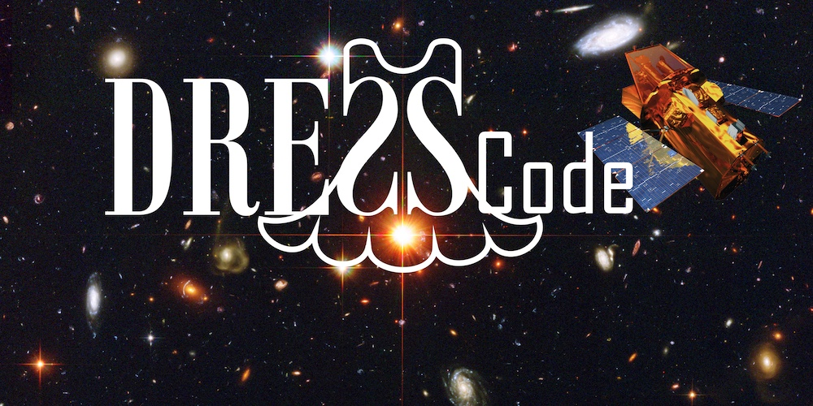

# DRESSCode: Swift data reduction

{ loading=lazy }

<p align="right" style="font-size: .7rem">
    <em>The DRESSCode logo (designed by J. De Wree), and the Swift space telescope, in front of the Hubble Ultra Deep Field.<br>©NASA/Swift. NASA, ESA and the Hubble Heritage Team (STScI/AURA).</em>
</p>

DRESSCode, short for Data Reduction of Extended Swift Sources Code, is a fully automated pipeline to reduce Swift UVOT images of extended sources. It consists of a series of python scripts that perform the different steps of the data reduction pipeline to all images. The different steps include preparation, creation of sky images, aspect correction, creation of auxiliary maps, combination of separate frames, several corrections to the flux, combination of different observing periods, calibration, and aperture correction. DRESSCode is a two-phase pipeline, which means that some steps are repeated a second time, in order to improve the accuracy of the astrometry of the images.

For the original version of this software, see [mdecleir/DRESSCode](https://github.com/mdecleir/DRESSCode).

---

**Documentation**: <a href="https://spacetelescope.github.io/DRESSCode/" target="_blank">https://spacetelescope.github.io/DRESSCode/</a>

**Source Code**: <a href="https://github.com/spacetelescope/DRESSCode/">https://github.com/spacetelescope/DRESSCode/</a>

---

## Requirements

DRESSCode has been written and tested on Linux and Mac, and relies on several tasks from the specialized [HEASoft](https://heasarc.gsfc.nasa.gov/docs/software/heasoft/) software, provided by NASA.

See the <a href="https://spacetelescope.github.io/DRESSCode/user_manual/install/" target="_blank">documentation</a> for specific installation instructions.

The minimum requirements are:

- Python 3.6 or later
- HEASoft 6.25 or later
- [caldb](https://heasarc.gsfc.nasa.gov/docs/heasarc/caldb/install.html): calibration tree
- [wcstools](http://tdc-www.harvard.edu/wcstools/): World Coordinate System utilities

### Docker

Docker can be used to run the software without having to complete the heasoft/caldb/wcstools installation procedure yourself (or to run on windows). The image can be found on [docker hub](https://hub.docker.com/repository/docker/dresscodeswift/dresscode).

To download and open an interactive shell:

```sh
docker pull dresscodeswift/dresscode
docker run --rm -it dresscodeswift/dresscode /bin/bash
```

From there run the pipeline, which is located in `/opt/dresscode`

For more, see our <a href="https://spacetelescope.github.io/DRESSCode/user_manual/install/#docker-installation" target="_blank">docker instructions</a>.

## License

This project is Copyright Association of Universities for Research in Astronomy and licensed under the terms of the BSD 3-Clause “New” or “Revised” License (see the [LICENSE](LICENSE.md) file for more information).

## Use cases and publications

- [Decleir et al. (2019)](https://ui.adsabs.harvard.edu/abs/2019MNRAS.486..743D/abstract) used a slightly older version of the DRESSCode (with only one phase) to reduce the Swift UVOT images of NGC628. These images were used to measure dust attenuation curves on resolved scales in NGC628. The paper also describes the details of the older version of the pipeline.
- The current version of the DRESSCode was used in the DustKING project, to reduce the Swift UVOT images of all KINGFISH galaxies. The goal of this project is to measure the global dust attenuation curves of all KINGFISH galaxies. This work will be published soon (Decleir et al., in prep.). The preliminary results of this work can be found in Chapter 4 of [Marjorie Decleir's PhD thesis](https://biblio.ugent.be/publication/8638711).
